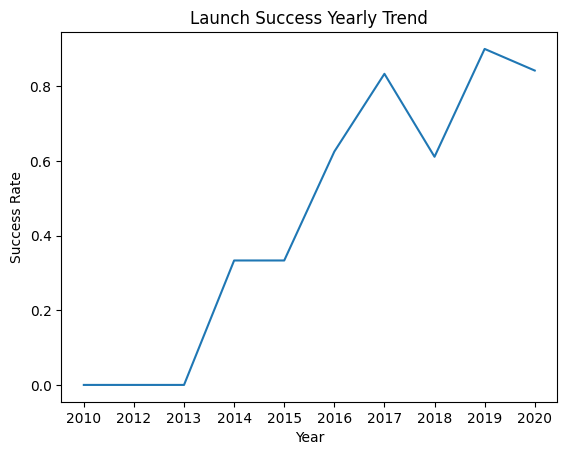
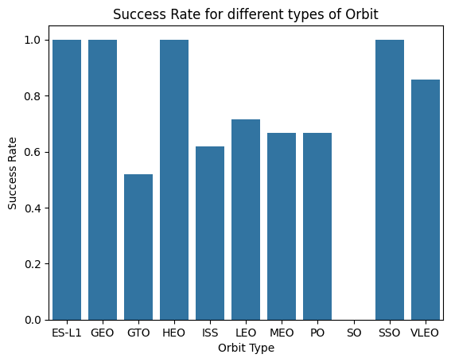
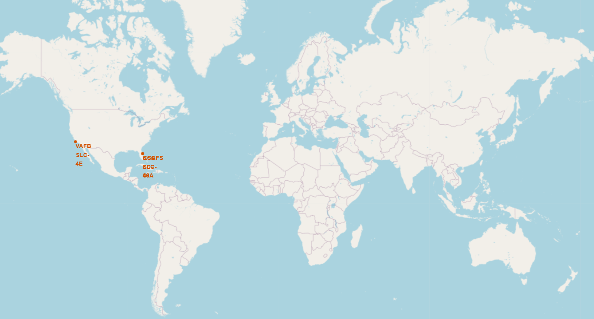
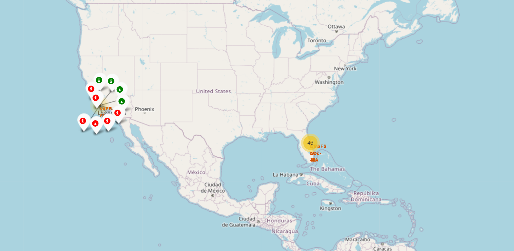
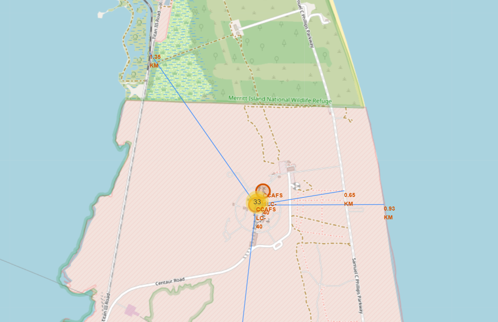
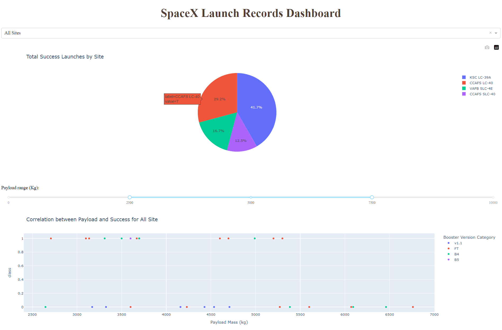
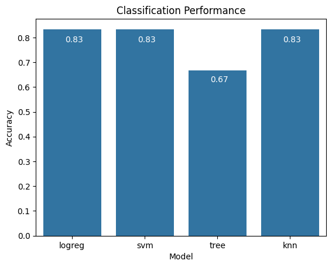
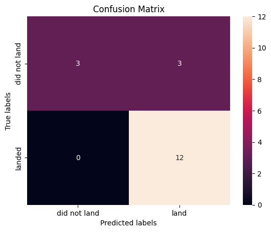

# SpaceX Falcon 9 First-Stage Landing Prediction

## Introduction

In the dynamic landscape of commercial space exploration, SpaceX has emerged as a pioneering force, redefining the possibilities of space travel. Central to SpaceX's remarkable achievements is the reusability of its Falcon 9 rocket's first stage. However, the unpredictability of the first stage's fate, whether it successfully lands or not, introduces a crucial factor in determining the precise cost of each space flight.

This project delves into SpaceX's launch data with a specific focus: predicting the success of Falcon 9's first-stage landings. The ability to accurately forecast whether a booster will land successfully holds profound implications for the cost-effectiveness of space missions. A reliable predictive model not only enhances our understanding of SpaceX's launch dynamics but also provides invaluable insights into the financial aspects of space exploration.

By leveraging data-driven insights, machine learning techniques, and interactive visual analytics, the project aims to unravel the factors influencing the success of booster landings. The ultimate goal is to contribute to the broader discourse on the cost dynamics of space travel, paving the way for informed decision-making in the evolving landscape of commercial space exploration.

## Methodology

- **Data Collection**

In this project, I utilized the SpaceX REST API to gather relevant data, encompassing launch details such as rocket information, payload specifics, and landing outcomes. Additional Falcon 9 launch records were acquired through web scraping using Python's BeautifulSoup package. The combination of API and web scraping methodologies provided a robust foundation for extracting diverse information about SpaceX launches.

- **Exploratory Data Analysis (EDA)**

The EDA phase serves as the foundation for this project, offering key insights into Falcon 9 rocket launches and setting the stage for subsequent analyses.

Initially, I dive into the dataset using a database and SQL, extracting valuable information for in-depth examination. The next step involves creating visualizations to identify correlations between attributes and successful landings, with a keen focus on determining the key factors that influence outcomes.
Throughout this phase, the goal is to unravel the intricate relationships within the data, establishing a solid base for informed decision-making in the project's later stages.

- **Interactive Visual Analytics**

Interactive visual analytics introduces a dynamic and real-time approach to exploring and manipulating data, allowing users to swiftly identify visual patterns and enhancing the effectiveness of data exploration.
Within this section, I utilize Folium and Plotly Dash to craft an interactive map and dashboard, providing a platform for in-depth analysis.

- **Predictive Analysis**

The project entailed constructing a robust machine learning pipeline aimed at predicting the success of Falcon 9's first-stage landings. This involved a systematic approach, encompassing hyperparameter tuning, model training, and evaluation, ultimately leading to the identification of the best-performing model.

## Results

### EDA

The exploratory data analysis uncovered valuable patterns and correlations within the dataset. Here are some key insights drawn from the analysis:

The line graph indicates a positive trend in the launch success rate over the years.

The bar chart provides an overview of the success rates of booster landings based on the type of orbit to which the rockets were launched.
(Please refer to the Notebooks for more insights!)

### Interactive Visual Analytics

Utilizing Folium and Plotly Dash facilitated a more dynamic and engaging exploration of launch site geo-proximities, providing valuable insights into SpaceX's launch dynamics. Here are a few examples:

- The following shows launch sites’ locations on the global map

The geographical analysis reveals a notable trend: all launch sites are situated near the Equator line, and interestingly, they are strategically positioned near coastlines. This strategic placement aligns with the optimal trajectory for space launches, capitalizing on the Earth's rotational speed near the Equator and facilitating more energy-efficient and cost-effective missions.

- The following shows launch outcomes labeled by color

Exploring the map further enhances the insights. Zooming in allows for a detailed examination of launch outcomes at each specific launch site. The color-coded markers, with green denoting successful launches and red indicating unsuccessful ones, provide a visual representation of the success outcomes, enabling a more nuanced understanding of the performance at individual launch sites.

- Additionally, it is possible to see launch site’s distance from its proximities

Continued exploration of the map in this image unveils specific details about the CCAFS launch site. Proximity to key infrastructure such as the railway, highway, and coastline is evident, with calculated distances displayed. This deliberate positioning showcases a safety-conscious approach, as launch sites maintain a distance from urban areas. Intriguingly, the proximity to railways, highways, and coastlines underscores the strategic selection of locations for operational efficiency and logistical convenience.

- The following is a screenshot of the dashboard created using Plotly Dash

The dashboard features a dynamic visualization with a pie chart and a scatter plot. The pie chart offers a comprehensive view of success rates based on the selection made in the dropdown menu, providing a quick overview of mission outcomes for different launch sites.
The scatter plot, on the other hand, offers a detailed exploration of launch outcomes concerning payload mass. The range slider atop the plot empowers users to customize the displayed payload range, facilitating a more granular analysis. Additionally, this plot serves as a valuable tool for interpreting the performance of various boosters in relation to payload, enhancing the depth of insights gained from the dashboard.

### Predictive Analysis

Various machine learning models, including K-Nearest Neighbors (KNN), Logistic Regression, Decision Tree Classifiers, and Support Vector Machines (SVM), were developed and evaluated. The machine learning pipelines demonstrated an impressive overall accuracy of 83%. These classification models excelled in identifying positive instances, achieving a 100% True Positive Rate. However, there is room for improvement in accurately identifying negative instances, as reflected by a 50% True Negative Rate. The results underscore the models' robustness and point towards potential areas for refinement.
The bar chart below presents an overview of the accuracy achieved by all the developed models when tested on the dataset.

The accompanying Confusion Matrix visually represents the performance of our machine learning model, specifically the SVM model in this instance. This matrix is a crucial tool for assessing the predictive accuracy of the models by detailing the number of True Positives, True Negatives, False Positives, and False Negatives. Through a comprehensive analysis of the Confusion Matrix, we gain valuable insights into the model's strengths and areas for improvement. This information is instrumental in making informed decisions to refine and enhance the model's effectiveness in predicting Falcon 9's first-stage landings.

As previously mentioned, this model excels in identifying positive instances, showcasing a remarkable 100% True Positive Rate. Nevertheless, there is an opportunity for improvement in accurately identifying negative instances.

## Conclusion

The systematic approach, spanning from data exploration and interactive visualization to machine learning and model evaluation, contributes to a holistic understanding of factors influencing the success of Falcon 9's first-stage landings.

**Classification Model Performance:**
The developed classification model showcased commendable accuracy, demonstrating its proficiency in correctly classifying instances. The ability to predict the success of Falcon 9's first-stage landings has profound implications for SpaceX and the broader space exploration community.

**Operational Efficiency for SpaceX:**
For SpaceX, an accurate predictive model provides a valuable tool for optimizing operational efficiency and cost-effectiveness. By anticipating booster landing outcomes, SpaceX can strategically plan and allocate resources, reducing potential financial risks associated with unsuccessful landings.

**Enhancing Decision-Making:**
The insights gained from this project empower SpaceX to make more informed decisions regarding mission planning, resource allocation, and risk management. The model's ability to identify positive instances with a remarkable 100% True Positive Rate enhances confidence in decision-making processes.

**Considerations for the Space Exploration Community:**
Beyond SpaceX, the success of this predictive model contributes to the broader space exploration community. Similar machine learning approaches can be adopted by other space agencies and private enterprises to enhance their understanding of mission outcomes, promote sustainability, and pave the way for cost-effective space exploration.

**Recommendations for Future Steps:**
While the model has demonstrated robustness, the identification of potential areas for refinement, particularly in accurately identifying negative instances, suggests avenues for future improvement. Continuous analysis, refinement of the model, addressing class imbalances, and investigating influential features will be crucial for advancing the predictive capabilities of such models.

In summary, the successful deployment of a predictive model for Falcon 9's first-stage landings not only benefits SpaceX in its operational endeavors but also contributes valuable knowledge to the wider space exploration community. As the space industry continues to evolve, data-driven insights become increasingly instrumental in shaping the future of space travel.

## Tools and Technologies

- Python
- SQL
- NumPy
- Pandas
- Requests
- BeautifulSoup
- sqlite3
- Matplotlib
- Seaborn
- Folium
- Plotly
- Dash
- Sklearn

## Remarks and Instructions for Usage

**1. Data Usage:**
- Not all acquired data is utilized in this project.
- For consistency and comparable results, consider using the provided dataset in this repository.

**2. Code Comments:**
- Some code lines are commented in the notebooks to prevent package dependency conflicts. Uncomment the packages you don't have and install them before proceeding.

**3. Database Usage:**
- The created database is for EDA using SQL (for practicing and honing SQL skills). Similar analyses can be done using Python; choose the approach that suits you.

**4. Plotly Dashboard Setup:**
- Ensure all required packages are installed in your active environment.
- Open a terminal and navigate to the location of the dash Python script (e.g., cd C:\location).
- Run the file by typing: python example.py.
- Follow the local host address (Ctrl + click) generated in your terminal.
- Now you should be able to see and interact with the dashboard in your browser.
- Once finished, press Ctrl+C in the terminal and close it.

**5. Project Origin:**
- I created this project as the final capstone project of the [IBM Data Science course](https://www.coursera.org/account/accomplishments/specialization/4AXNPGXRDRV9)

**6. Contact:**
- For any inquiries, collaboration opportunities, or feedback, please don't hesitate to connect with me on [LinkedIn](https://www.linkedin.com/in/hamidrezarahimi/). Your insights are highly valued and appreciated.

